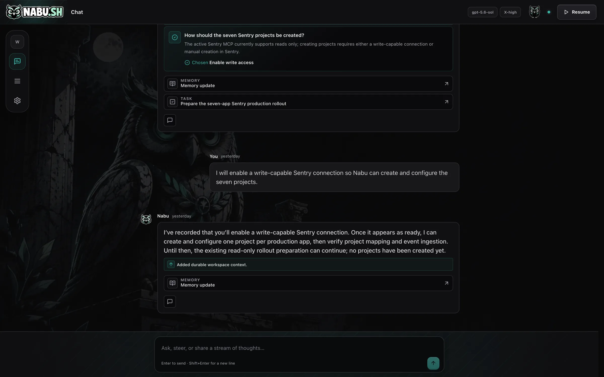
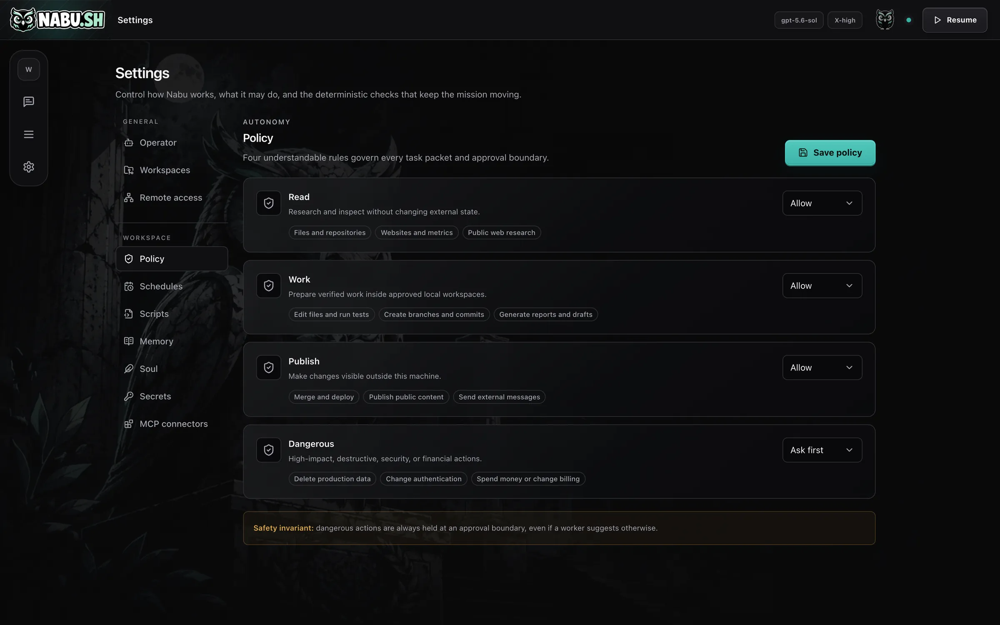
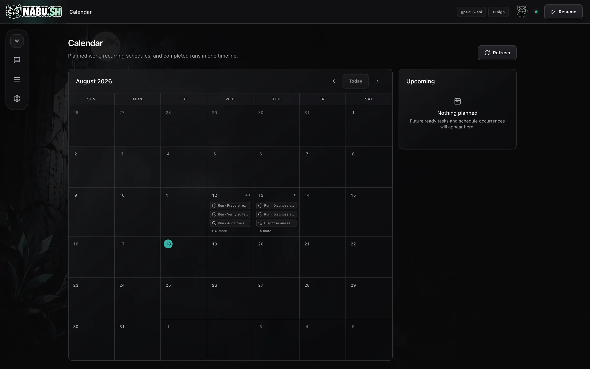

<div align="center">


### Codex works in bursts. Nabu works the whole shift.

A local, always-on operator that owns your missions, queue, approvals and schedules,
then hands bounded work to the Codex CLI you already pay for.

[](LICENSE)
[](#what-you-need)
[](go.mod)
[](#what-you-need)
[](#your-machine-your-data)

[**Install**](#quick-start) · [**How it works**](#codex-executes-nabu-operates) · [**Safety model**](#four-rules-decide-what-it-may-do-alone) · [**nabu.sh**](https://nabu.sh)

```sh
curl -fsSL https://nabu.sh/install.sh | bash && nabu setup
```

</div>

<br />



<br />

## Why this exists

Coding agents are brilliant for twenty minutes and then they forget everything.

You open a terminal, explain the context again, watch it work, approve a few things,
close the laptop, and the whole thread evaporates. Tomorrow you start over. The agent
never got to be a colleague, because a colleague is someone who remembers Tuesday.

Nabu is the missing half. It runs as a background service on your own machine and keeps
the parts that need to persist: the mission, the queue, what has been approved, what is
scheduled, what it learned, and a written record of everything it did. When there is
work to do, it hands a bounded packet to Codex and gets out of the way.

You close the browser. It keeps going.

## Codex executes. Nabu operates.

Nabu is not another model, and not another wrapper around one. It is the layer above the
agent.

| Codex already does this | Nabu adds this |
| --- | --- |
| Bounded reasoning on a single task | Durable missions that survive restarts and crashes |
| Editing files and running tests | A workspace-scoped queue with real priorities |
| Working inside a sandbox you approve | Approval boundaries that hold, on every packet |
| Being very good while you watch | Recurring schedules, memory, and reports you can read later |

## Four rules decide what it may do alone



Every task packet is checked against the same four boundaries before anything runs. Set
each one to **allow** or to **ask first**:

- **Read.** Research and inspect without changing external state.
- **Work.** Prepare verified work inside approved local workspaces.
- **Publish.** Make changes visible outside this machine.
- **Dangerous.** High impact, destructive, security or financial actions.

Dangerous actions are held at an approval boundary always, even if a worker suggests
otherwise. That invariant is enforced in the daemon, not in a prompt.

## What else is in the box

<table>
<tr>
<td width="50%" valign="top">

**Calendar**

Planned work, recurring schedules and completed runs in one timeline, so you can see what
it did overnight without reading a log.



</td>
<td width="50%" valign="top">

**Reports**

Durable Markdown results with linked artifacts, kept long after the run that produced
them.


</td>
</tr>
</table>

Plus the plumbing you would otherwise build yourself:

- **Database.** Workspace-scoped typed datasets with row CRUD, server-side search and
  sort, JSON import, and CSV or JSON export.
- **Memory and Soul.** Durable context that outlives any single run.
- **Secrets.** Integration credentials live in the OS keychain, never in chat, SQLite,
  prompts, logs, or command arguments.
- **MCP connectors and scripts.** Registered, schedulable, and bounded.
- **Remote access.** Reach the interface from your phone over Tailscale, still without
  exposing a public port.

## Quick start

```sh
# 1. Install. Puts `nabu` and `nabud` in ~/.local/bin
curl -fsSL https://nabu.sh/install.sh | bash

# 2. Set up. Checks Codex and Git, picks your workspaces, installs the
#    background service, and opens the interface
nabu setup
```

The interface lives at <http://127.0.0.1:7777>. The browser is only a window onto the
daemon. Closing it stops nothing.

### Commands

| Command | What it does |
| --- | --- |
| `nabu setup` | Initialize Nabu and install the user service |
| `nabu open` | Open the local web interface |
| `nabu status` | Show the daemon and mission status |
| `nabu start` / `stop` / `restart` | Control the background service |
| `nabu logs` | Show recent daemon logs |
| `nabu doctor` | Check the local installation |
| `nabu uninstall` | Remove the service. Your durable data is preserved |

## What you need

- **The Codex CLI, installed and signed in.** Codex is the only engine Nabu drives today,
  and it uses the plan you already pay for. Support for other agents is not here yet.
- **macOS or Linux.** A LaunchAgent on macOS, a systemd user unit on Linux. Windows works
  through WSL2.
- **Git**, for the workspaces Nabu writes in, so its changes stay reviewable.

That is the whole list. There is no account to create and no key to paste.

## Your machine, your data

Nabu listens only on loopback, validates `Host` and `Origin` on every request, and runs
Codex with an explicit workspace-write sandbox. Operational state lives in SQLite under
`~/.nabu`, integrity-checked and backed up once a day. Workspace selection is an
authorization boundary: tasks and records are scoped to the active approved workspace.

There is no server of ours in the loop. There is no telemetry. Nothing phones home.

Each Nabu-created workspace is organized with `inbox`, `documents`, `media`, `research`,
`data`, `repos`, `reports`, `deliverables`, and `archive`. Connecting an established
folder leaves its structure untouched.

## Building from source

Requirements: Go 1.24+, Node.js 22+, the Codex CLI on `PATH`, and Git.

```sh
make frontend
make build
NABU_HOME="$PWD/.nabu-dev" ./bin/nabud
```

Then open <http://127.0.0.1:7777>. For frontend iteration, keep `nabud` running and use
Vite in another terminal:

```sh
cd frontend
npm install
npm run dev   # proxies /api to the Go daemon
```

### Verification

```sh
go test -race ./...
go vet ./...

cd frontend
npm run typecheck
npm run lint
npm test -- --run
npm run build
npm audit --omit=dev
```

Operational recovery, backups, logs, service commands, and uninstall behavior are
documented in [OPERATIONS.md](./OPERATIONS.md).

## Contributing

Issues and pull requests are welcome. A few things worth knowing before you start:

- The daemon is Go with no CGo, so it cross-compiles cleanly. Keep it that way.
- Database changes go through the numbered migrations in `internal/store/store.go`.
  Migrations run once, in order, and are never edited after release.
- The safety invariants in `internal/api` and the policy engine are the load-bearing part
  of this project. Changes there need tests.
- Run the full verification block above before opening a pull request.

## License

MIT. See [LICENSE](LICENSE).

Third-party interaction and layout patterns are credited in
[frontend/THIRD_PARTY_NOTICES.md](frontend/THIRD_PARTY_NOTICES.md).

<div align="center">
<br />

<br /><br />
<sub>Nabu was the Babylonian god of writing, record keeping, and wisdom.<br />
It seemed like the right name for something that remembers what you did.</sub>
</div>
